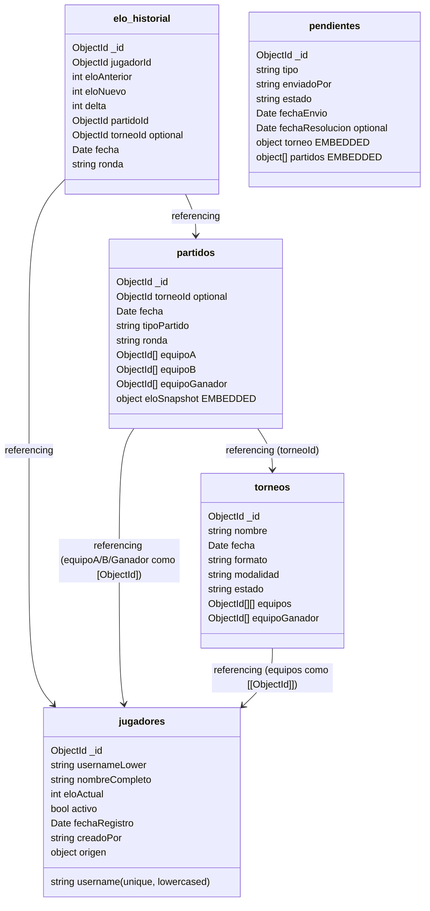
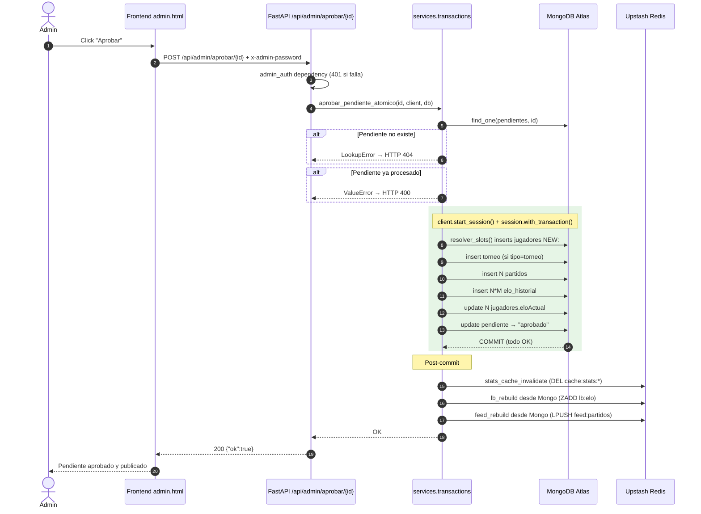
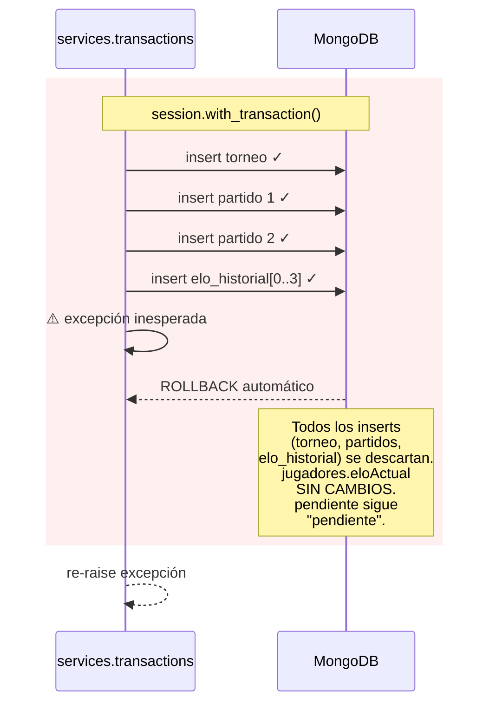

# Esquema de colecciones + decisiones de modelado

## Diagrama de colecciones



---

## Flujo de aprobación con transacción ACID

Este diagrama muestra qué pasa cuando el admin aprueba un pendiente y dónde
puede fallar la transacción. Es el punto más crítico del sistema desde la
óptica de integridad.



### Qué pasa cuando algo falla a mitad de la transacción



Este escenario está cubierto por `tests/test_transactions_integration.py::test_rollback_no_deja_data_parcial_cuando_falla_mitad_transaccion` — que pasa contra Atlas real (no mocks).

---

## Las 3 decisiones de modelado (Embedding vs Referencing)

### Decisión 1: `partidos.eloSnapshot` → **EMBEDDED**

```js
partidos: {
  ...
  eloSnapshot: { promedioA: 1215, promedioB: 1217 }  // <- embebido
}
```

**Por qué embedded:**
- Es **inmutable** una vez creado el partido (es un snapshot histórico, no se vuelve a calcular).
- **Tamaño acotado**: 2 ints fijos (`promedioA`, `promedioB`). Nunca crece. Lejos del límite de 16 MB.
- **Patrón de acceso**: SIEMPRE se lee junto al partido (es contexto del partido, no tiene vida propia).
- Si fuera una colección aparte, cada lectura de partido requeriría un `$lookup` extra para algo que es 2 enteros.

**Trade-off aceptado:** si quisiéramos cambiar el algoritmo de ELO retroactivamente, tendríamos que iterar todos los partidos para recomputar — pero no es un caso de uso real (el ELO histórico se respeta como sucedió).

### Decisión 2: `partidos.equipoA / equipoB / equipoGanador` → **REFERENCING**

```js
partidos: {
  equipoA:       [ObjectId("..."), ObjectId("...")],  // refs
  equipoB:       [ObjectId("..."), ObjectId("...")],
  equipoGanador: [ObjectId("..."), ObjectId("...")],
}
```

**Por qué referencing (no embedded):**
- Un jugador **muta**: cambia su `username`, `nombreCompleto`, `eloActual`. Si embebiéramos al jugador entero, **cada cambio de nombre obligaría a reescribir N partidos** (uno por cada partido del jugador). Para Marco que tiene ~60 partidos, eso son 60 updates por rename.
- **Tamaño**: si embebiéramos jugador completo (con todos sus campos + futuros), un partido pesaría > 2 KB. Con refs, pesa ~150 B. Multiplicado por 2000 partidos = 4 MB vs 300 KB.
- **Read pattern**: cuando muestro un partido en `/api/stats/partidos`, hago un `$lookup` a `jugadores` que es **barato** (índice por `_id`) y devuelve sólo username + nombreCompleto. La latencia agregada es negligible.
- **Una sola fuente de verdad** para los datos del jugador (evita inconsistencias entre `partidos.equipoA[0].username` y `jugadores._id.username`).

### Decisión 3: `pendientes.partidos` → **EMBEDDED como array**

```js
pendientes: {
  tipo: "torneo",
  torneo: { nombre, fecha, equipos: [[ObjectId]], ganador: [ObjectId] },  // embedded
  partidos: [                                                              // embedded array
    { equipoA, equipoB, equipoGanador, ronda },
    ...
  ]
}
```

**Por qué embedded:**
- Un pendiente es **una unidad atómica de revisión**. El admin aprueba o rechaza el torneo completo, no partidos individuales. Mantener todo en un solo doc significa que `db.pendientes.findOne(...)` trae todo lo necesario para mostrarlo en el panel, sin joins.
- **Tamaño acotado** por el tamaño de un torneo razonable: 8 equipos × 3 jugadores + ~15 partidos = ~3 KB. Lejísimos del límite.
- **Lifecycle corto**: el pendiente vive minutos/horas hasta que se procesa, después se borra o se marca aprobado. No es data de largo plazo.
- Si en cambio referenciáramos partidos en una colección `partidos_pendientes` separada, agregaríamos un join + complejidad para algo que se mira como un todo.

**Importante:** al aprobar, los `pendientes.partidos` (embebidos) se transforman en documentos individuales en la colección `partidos` (con refs a `jugadores`). Esa transformación es parte de la **transacción ACID** documentada en [`SCHEMA.md`](./SCHEMA.md) → ver `services/transactions.py`.

---

## Validator JSON Schema (Mongo-level)

La colección `jugadores` tiene (o debería tener) un validator `$jsonSchema` aplicado vía:

```js
db.runCommand({
  collMod: "jugadores",
  validator: {
    $jsonSchema: {
      bsonType: "object",
      required: ["username", "usernameLower", "nombreCompleto", "eloActual", "activo", "fechaRegistro"],
      properties: {
        username:       { bsonType: "string", pattern: "^[a-zA-Z0-9_]{3,20}$" },
        usernameLower:  { bsonType: "string" },
        nombreCompleto: { bsonType: "string", minLength: 2, maxLength: 60 },
        eloActual:      { bsonType: ["int", "double"] },
        activo:         { bsonType: "bool" },
        fechaRegistro:  { bsonType: "date" }
      }
    }
  },
  validationLevel: "moderate",
  validationAction: "error"
})
```

Esto es **defensa en profundidad**: aunque el código Python valida en `services/slots.py` antes de insertar, el validador de Mongo es la última línea ante un bug o un script que escriba directo a la DB.
